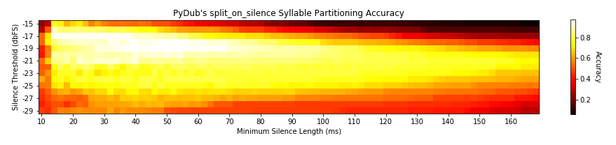

# Vocalize

## About

Vocalize is a project by Jeffrey Holm, Louisa Lee, and Pranav Dhingra for the EECS 352 - Machine Perception of Audio course under the supervision of professor Bryan Pardo and advisor Fatemah Pishdadian. Please email jholm@u.northwestern.edu with any questions.

## Motivation (why?)

Vocalize is designed to map text onto an instrumental audio signal such that the text is “sung” on top of the melody of the tune. Ultimately, we wanted to create a “text to sing” software that would combine state of the art techniques in text to speech synthesis, melody extraction, pitch identification, and autotuning so that vocals can be synthesized completely from a machine when given text and and a base instrumental audio piece.

## Usage

1. Vocalize will take a text file of lyrics and an audio file of a song as input.
2. Using the text file, we generate audio of the spoken lyrics and separate it into syllables.
3. With source separation software we are able to pull out the  foreground (melody) and background signals of the input song.
4. Running onset detection and pitch tracking software on the foreground signal gives us the melodic rhythm and pitch.
5. We map the syllables to the melodic rhythm and pitch to construct a new vocal signal that is "singing" the lyrics.
6. We combine the new vocal signal and the background signal of the song to form a new song.

### Build

test

### Test

## Results

test
