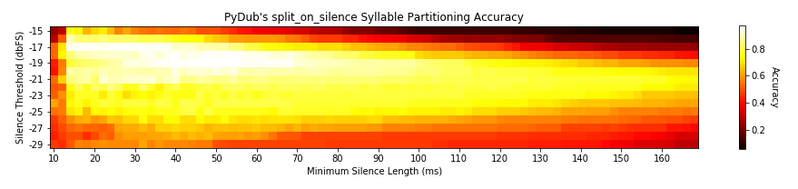
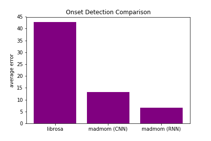

## About Us

Vocalize is a project by Jeffrey Holm, Louisa Lee, and Pranav Dhingra for the EECS 352 - Machine Perception of Audio course under the supervision of professor Bryan Pardo and advisor Fatemah Pishdadian. Please email jholm@u.northwestern.edu with any questions.

## Motivation

Vocalize is designed to map text onto an instrumental audio signal such that the text is “sung” on top of the melody of the tune. Ultimately, we wanted to create a “text to sing” software that would combine state of the art techniques in text to speech synthesis, melody extraction, pitch identification, and autotuning so that vocals can be synthesized completely from a machine when given text and and a base instrumental audio piece.

## Overview

1. Vocalize will take a text file of lyrics and an audio file of a song as input.
2. Using the text file, it generates audio of the spoken lyrics and separates it into syllables.
3. Using the input audio file, Vocalize separates the foreground (melody) from the background.
4. It extracts melodic rhythm and pitch of the foreground signal through onset detection and pitch tracking.
5. It maps the syllables from step 2 on to the melodic rhythm and pitch from step 4 to construct a new vocal signal that is “singing” the lyrics.
6. Finally, Vocalize combines the new vocal signal and the background signal of the song to form a new song.

## Build/Test

### Speech Generation

We used [eSpeak] to generate spoken word audio from text. We were able to create a custom parameterized [voice](espeak-data/voices/robot) which allowed us to control various features of the voice output. Most notably we flattened the pitch and intonation of the voice so that the pitch of the generated voice was constant. This enabled us to later shift the signal to the target pitch more accurately.

<audio controls="controls"><source src="audio/flymetothemoon_speech.wav" type="audio/x-wav">Your browser does not support the audio element</audio>

### Syllable Separation

One of our goals was to map one syllable to one note of the melody. The reason being that multiple syllables of the same word could be sung at different pitches in a song. Take the *Happy Birthday* tune for example. The pitch for 'birth' is a whole step higher than the pitch for 'day'.

In order to achieve this separation, we used the [Pydub] library which provides a utility to split audio signals on periods of silence. The `split_on_silence` function takes two parameters for deciding what is considered silence and hence, where to split the signal:

- **Silence Threshold** - anything quieter than this will be considered silence
- **Minimum Silence Length** - minimum length of a silence to be used for a split

In order to achieve optimal performance, we ran an experiment to determine the best combination of parameters. Using a dataset that related words to their number of syllables when spoken, we were able to measure the accuracy of a given parameter combination by checking if the number of syllables generated for each word was correct for some set of words. Below we have plotted the results of the experiment and on a corpus of 500 words, the best combination had an accuracy of 96%.



### Source Separation

We used [nussl] to separate the melody from the background of the input audio signal. The melody was then processed through onset detection and pitch tracking.

Foreground

<audio controls="controls"><source src="audio/flymetothemoon-melody.wav" type="audio/x-wav">Your browser does not support the audio element</audio>

Background

<audio controls="controls"><source src="audio/flymetothemoon-background.wav" type="audio/x-wav">Your browser does not support the audio element</audio>

### Pitch Tracking

We were able to use the [Melodia] algorithm in order to track the pitch of the melody. Given an audio signal, Melodia could return a time series of the melodic fundamental frequency.


### Onset Detection

Another one of our goals was to find the starting time for every note in the melody so that we could modify each syllable to the correct pitch and rhythm of the given note. We used onset detection to find the intervals of every note under the assumption that every new note would be represented as a peak in the audio signal. There were three different methods investigated in our approach: [LibROSA]'s onset detection, [Madmom]’s onset detection using a Convolutional Neural Network, and Madmom’s onset detection using a Recurrent Neural Network.

The three methods were compared on 10 snippets of audio, which included one note piano melodies, instrumental solos, and voice with instrumental tracks. The graph below shows the average error of each method in determining the number of onsets for each audio clip. It can be seen that Madmom’s RNN method of onset detection had the best performance on the 10 randomly chosen audio samples. As a result, we have chosen to use this method to determine the onsets of each note in the audio signal.



Below you can hear a signal superimposed with clicks at each detected onset.

<audio controls="controls"><source src="audio/flymetothemoon_clicks.wav" type="audio/x-wav">Your browser does not support the audio element</audio>

### Voice Transformation

We utilized LibROSA's pitch shifting and time stretching functionalities to transform the given voice signal to match the melodic pitch and rhythm.

<audio controls="controls"><source src="audio/flymetothemoon_tunedvoice.wav" type="audio/x-wav">Your browser does not support the audio element</audio>

## Results

Input text

```python
"""
Fly me to the moon
Let me play among the stars
"""
```

Input song

<audio controls="controls"><source src="audio/FlyMeToTheMoon.wav" type="audio/x-wav">Your browser does not support the audio element</audio>

Output

<audio controls="controls"><source src="audio/flymetothemoon_output.wav" type="audio/x-wav">Your browser does not support the audio element</audio>

## Related Work

- Simon, Ian, Dan Morris, and Sumit Basu. "MySong: automatic accompaniment generation for vocal melodies." Proceedings of the SIGCHI conference on human factors in computing systems. ACM, 2008.
<https://dl.acm.org/citation.cfm?id=1357169.>
- Saitou, Takeshi, et al. "Speech-to-singing synthesis: Converting speaking voices to singing voices by controlling acoustic features unique to singing voices." 2007 IEEE Workshop on Applications of Signal Processing to Audio and Acoustics. IEEE, 2007.
<https://ieeexplore.ieee.org/abstract/document/4393001.>
- George, E. Bryan, et al. "Singing voice synthesis." U.S. Patent No. 6,304,846. 16 Oct. 2001.
<https://patents.google.com/patent/US6304846B1/en>.
- Salamon, Justin, and Emilia Gómez. "Melody extraction from polyphonic music signals using pitch contour characteristics." IEEE Transactions on Audio, Speech, and Language Processing 20.6 (2012): 1759-1770.
<https://ieeexplore.ieee.org/abstract/document/6155601>.

<!-- Reference Links -->

[Pydub]: http://pydub.com/
[LibROSA]: https://librosa.github.io/
[eSpeak]: http://espeak.sourceforge.net/
[nussl]: https://interactiveaudiolab.github.io/nussl/
[Madmom]: https://madmom.readthedocs.io/en/latest/
[Melodia]: https://www.upf.edu/web/mtg/melodia
